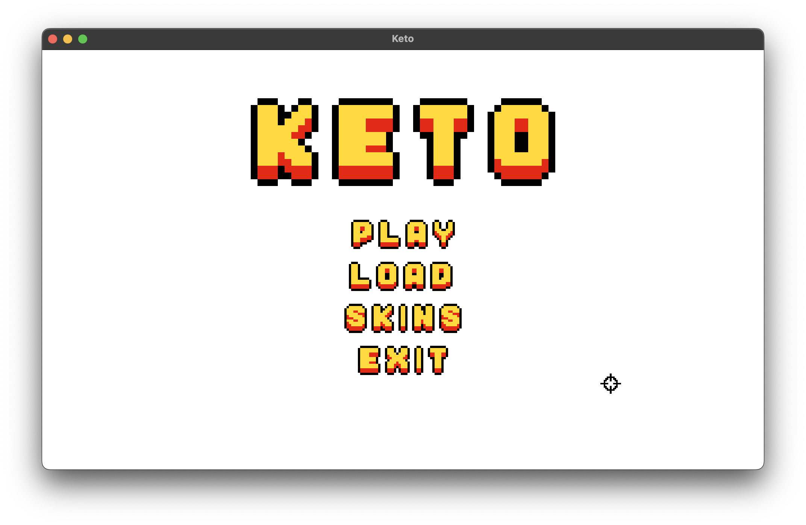
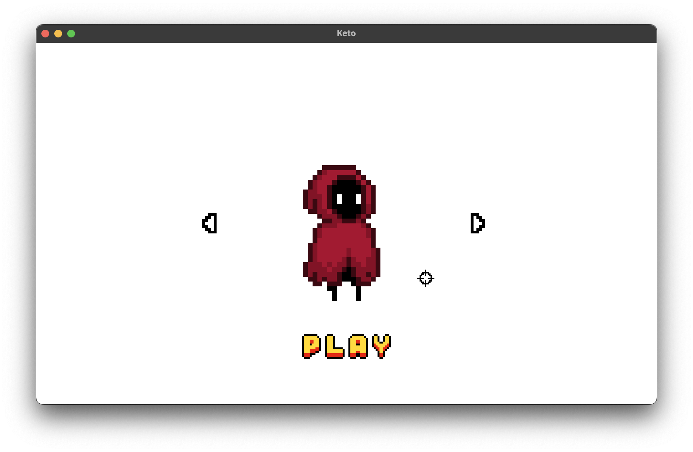
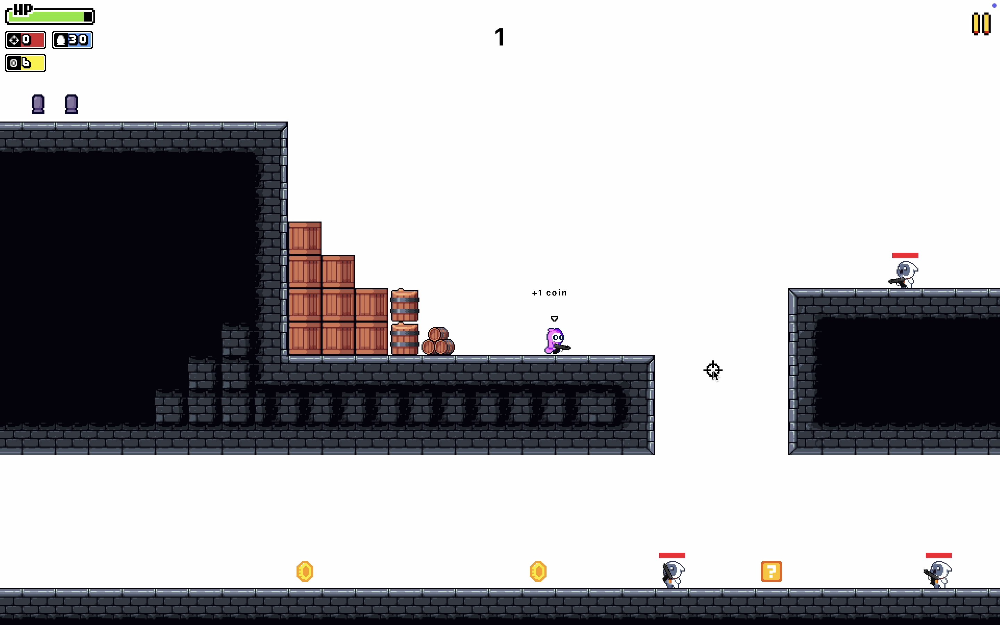

# Keto

A fast-paced 2D platformer game built from scratch in C++ using the Raylib graphics library. Navigate through challenging levels, defeat enemies, and test your reflexes in this action-packed adventure.

<div align="center">
  
  
  
</div>


## About The Project

Keto is a 2D platformer that combines classic platforming mechanics with modern game design. The game features multiple levels, enemy AI, a save/load system, customizable player skins, and smooth gameplay powered by Raylib's efficient rendering engine.

### What Makes This Project Special

This project demonstrates:
- **Object-oriented game architecture** with clean separation of concerns (Player, Enemy, Bullet, Map, Game classes)
- **Custom physics implementation** for platformer movement and collision detection
- **Save/load system** using JSON serialization for persistent game state
- **Level design system** with procedural map generation capabilities
- **Modern C++ practices** (C++17 standard) with proper memory management

## Technical Stack

- **Language**: C++17
- **Graphics Library**: [Raylib 5.5](https://github.com/raysan5/raylib) - A simple and easy-to-use library for game programming
- **JSON Library**: [nlohmann/json 3.11.2](https://github.com/nlohmann/json) - For save data serialization
- **Build System**: CMake 3.15+

## Key Features

- **Multiple Levels**: Progress through increasingly challenging stages
- **Combat System**: Shoot enemies to clear your path
- **Save/Load Functionality**: Save your progress at any time (CTRL+S or via pause menu)
- **Customizable Skins**: Personalize your player character
- **Smooth Controls**: Responsive arrow key movement and mouse-based shooting
- **Pause Menu**: Access game options without losing progress

## Development Challenges

Building this game presented several interesting technical challenges:

1. **Collision Detection**: Implementing precise collision detection for platformer physics required careful consideration of edge cases and pixel-perfect accuracy.

2. **Game State Management**: Designing a clean state machine to handle transitions between menu, gameplay, pause, and level completion states.

3. **Save System Architecture**: Creating a robust serialization system that could save and restore the complete game state, including player position, level progress, and inventory.

4. **Enemy AI**: Developing enemy behavior patterns that are challenging but fair, with proper pathfinding and attack logic.

5. **Cross-platform Build System**: Setting up CMake to automatically fetch and build dependencies (Raylib and nlohmann/json) without requiring manual installation.

## Building & Running

> **Note**: The CMake configuration automatically downloads and builds all necessary dependencies (Raylib and nlohmann/json). No manual installation required!

### Prerequisites

- CMake 3.15 or higher
- C++17 compatible compiler (GCC, Clang, or MSVC)
- Git

### Build Instructions

1. **Clone the repository**
   ```bash
   git clone https://github.com/ayoubdlf/keto
   cd keto
   ```

2. **Configure the build**
   ```bash
   cmake -B build -S .
   ```
   This will automatically fetch Raylib and nlohmann/json from GitHub.

3. **Build the game**
   ```bash
   cmake --build build
   ```

4. **Run and enjoy!**
   ```bash
   ./build/keto.out
   ```

## How to Play

### Objective
Complete all levels by navigating through obstacles, defeating enemies, and reaching the flag at the end of each stage.

### Controls
- **Arrow Keys**: Move left/right and jump
- **Mouse Click**: Shoot in the direction of the cursor
- **CTRL+S**: Quick save your progress
- **ESC**: Pause menu

### Main Menu Options
- **Play**: Start a new game
- **Load**: Continue from your last save
- **Skins**: Customize your player appearance
- **Exit**: Quit the game

> **Tip**: If you select "Load" without any saved data, the game will automatically start a new playthrough.

## Project Structure

```
keto/
├── src/           # Source files (game logic, entities, systems)
├── include/       # Header files
├── assets/        # Game assets (sprites, sounds, etc.)
├── CMakeLists.txt # Build configuration
└── README.md      # This file
```


## Acknowledgments

- [Raylib](https://github.com/raysan5/raylib) - For providing an excellent game development framework
- [nlohmann/json](https://github.com/nlohmann/json) - For the intuitive JSON library
